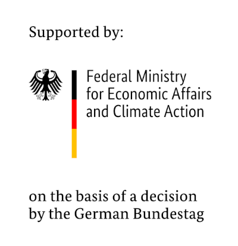

# Syclops


<h1 align="center">
  <br/>
  Syclops
</h1>
<p align="center">Syclops is a tool for creating synthetic data from 3D virtual environments.</p>
<p align="center">
  <a href="https://dfki-ni.github.io/syclops/">
    
  </a>
</p>

---

# 🎯 Features

📷 Photorealistic renderings of the virtual environment with pixel-perfect annotations

📄 No-Code scene and sensor configuration with a simple YAML syntax

🔧 Extensive randomization tools to increase the diversity of the generated data

💾 Asset management and viewer to easily reuse assets across multiple scenes

📦 Easy to use and extend with a modular architecture

# 🔍 Annotations

<div align="center">
  <br/>
</div>

Syclops supports a variety of annotated outputs for different use cases. The following outputs are currently supported:

|          Output           |                        Description                        |
| :-----------------------: | :-------------------------------------------------------: |
|          **RGB**          |                   Rendered color image                    |
| **Semantic Segmentation** |         Semantic segmentation mask with class ids         |
| **Instance Segmentation** |      Unique instance id for each object in the scene      |
|         **Depth**         |          Distance from the camera to each pixel           |
|    **Bounding Boxes**     |        Bounding boxes for each object in the scene        |
|   **Object Positions**    |          3D position of each object in the scene          |
|      **Point Cloud**      |         3D location of each pixel in camera space         |
|       **Keypoints**       |           Location of keypoints in camera space           |
|     **Object Volume**     |            Volume of each object in the scene             |
|   **Structured Light**    | Projected dot pattern for structured light reconstruction |

# ⚡️Getting Started

## Prerequisites

Before you install `Syclops`, ensure you have the following prerequisites:

- Python version 3.9 or higher.

We recommend using a virtual environment to avoid potential package conflicts. Below are instructions for setting up with `virtualenv` and `conda`.

## Installing

### Using `virtualenv`

If you don't have `virtualenv` installed:

```bash
pip install virtualenv
```

To create and activate a new virtual environment named `syclops`:

```bash
# For Linux/macOS
virtualenv syclops_venv
source syclops_venv/bin/activate

# For Windows
virtualenv syclops_venv
.\syclops_venv\Scripts\activate
```

### Using `conda`

If you use Anaconda or Miniconda, you can create a new environment:

```bash
conda create --name syclops_venv python=3.9
conda activate syclops_venv
```

### Installing Syclops

Once you have your environment set up and activated:

```bash
pip install syclops
```

### Alternatively: Clone and Install from Source

To install `Syclops` directly from the source code:

```bash
git clone https://github.com/DFKI-NI/syclops.git
cd syclops
pip install .
```

### Note for macOS Users

Installation on macOS is theoretically possible but is not currently officially supported or tested. If you are using macOS, Blender will be downloaded as a `.dmg` file for your architecture (arm64 or x64).

## Run a job

Next, the assets need to be crawled by the pipeline. This only needs to be done once, or if new assets are added.

```bash
syclops -c
```

> To run a **job**, a job file is needed. You can find an example in the [syclops/\_\_example_assets\_\_](https://github.com/DFKI-NI/syclops/blob/main/syclops/__example_assets__/example_job.syclops.yaml) folder.

To test the installation with the example job file run:

```bash
syclops --example-job
```

To run a job, simply pass the path to the job file to the `syclops` command:

```bash
syclops -j path/to/job.syclops.yaml
```

That's all you need to know to render images! 🎉

The rendered data will be in `output/<timestamp>` inside of your specified syclops directory.
To quickly visuzalize the data, you can use the dataset viewer tool.

> Adjust the output path accordingly.

```bash
syclops -da output/2022-09-01_12-00-00
```

# 🙏 Acknowledgements

We would like to thank our colleagues Timo Korthals ([@tik0](https://github.com/tik0)), Henning Wübben ([@hwuebben](https://github.com/hwuebben)), Florian Rahe ([@frahe-ama](https://github.com/frahe-ama)), Thilo Steckel and Stefan Stiene for their valuable feedback during the development of Syclops. Their involvement and the resulting insightful discussions have played a key role in shaping the project and setting its direction.

Syclops was developed in the research project Agri-Gaia. This work was supported by the German Federal Ministry for Economic Affairs and Climate Action within the Agri-Gaia project (grant number: 01MK21004A). The DFKI
Niedersachsen (DFKI NI) is sponsored by the Ministry of Science and Culture of Lower
Saxony and the VolkswagenStiftung. 

<p align="center">
  
  
  
</p>
