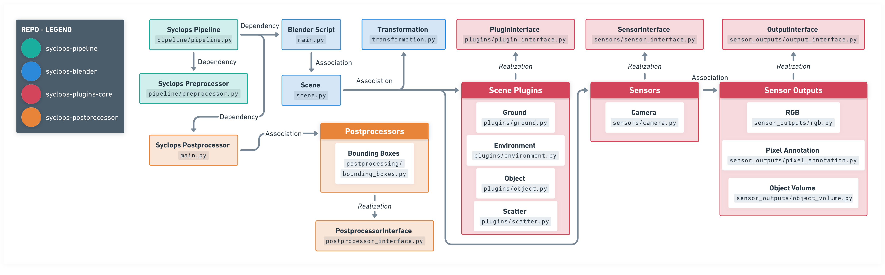

# Syclops Codebase Architecture

The following section provides an overview of the architectural structure of Syclops, helping developers and users understand the interplay between different components.

## Repository Overview

| Component/Folder | Description |
|:---:|:---:|
| **blender** | Contains the core code responsible for creating 3D scenes in Blender. It ensures that the virtual environment is rendered and prepared for data generation. |
| **blender/plugins** | Houses plugins that extend the pipeline's functionality. This includes plugins for the creation of a virtual scene, the lighting and objects. Both interface classes and their basic implementations can be found here. |
| **blender/sensors** | This folder houses the code used to add virtual sensors such as a camera to the scene. It also contains the interface class for simple extension of a new sensor.|
| **blender/sensor_outputs** | Contains the code for the sensor outputs. A sensor output is instanced by a sensor and is responsible for generating the data and ground truth annotation for that sensor. |
| **preprocessing** | Offers capabilities for altering the job description before the scene generation. It also generates the procedural textures for the scene. | 
| **postprocessing** | Offers capabilities for altering the generated synthetic data post-creation. It allows users to refine or adjust the outputs based on their requirements. |

### Key Components:
The following is a list of relevant files:

- **syclops**
    - **cli.py**: Contains the code for the syclops [CLI interface](../usage/command_line.md). It also orchestrates the preprocessing, postprocessing, and starting of Blender for the synthetic data generation.
- **syclops/preprocessing**
    - **preprocesor.py**: Script that gets called before the scene generation. It adjusts the job description and can create additional files that are needed for the scene generation.
- **syclops/postprocessing**
    - **main.py**: Entrypoint script that gets run as a parallel process to the Blender process. It is responsible for postprocessing the generated data.
    - **postprocessing_interface.py**: Contains the interface class for the postprocessing. It defines, how a postprocessing plugin should be structured.
- **syclops/blender**
    - **main.py**: Entrypoint script that gets run in Blender with the Blender Python environment.
    - **scene.py**: Contains the code for creating the 3D scene in Blender. It creates the transformation tree, and loads the plugin/sensor instances that are defined in the job file.
- **syclops/blender/plugins**
    - **plugin_interface.py**: Contains the interface class for the plugins. These are the classes that are used to generate objects or environments in the scene.
- **syclops/blender/sensors**
    - **sensor_interface.py**: Contains the interface class for the sensors. These are the classes that are used to place virtual sensors in the scene.
- **syclops/blender/sensor_outputs**
    - **output_interface.py**: Contains the interface class for the sensor outputs. A sensor output is instanced by a sensor and is responsible for generating the data for that sensor.
