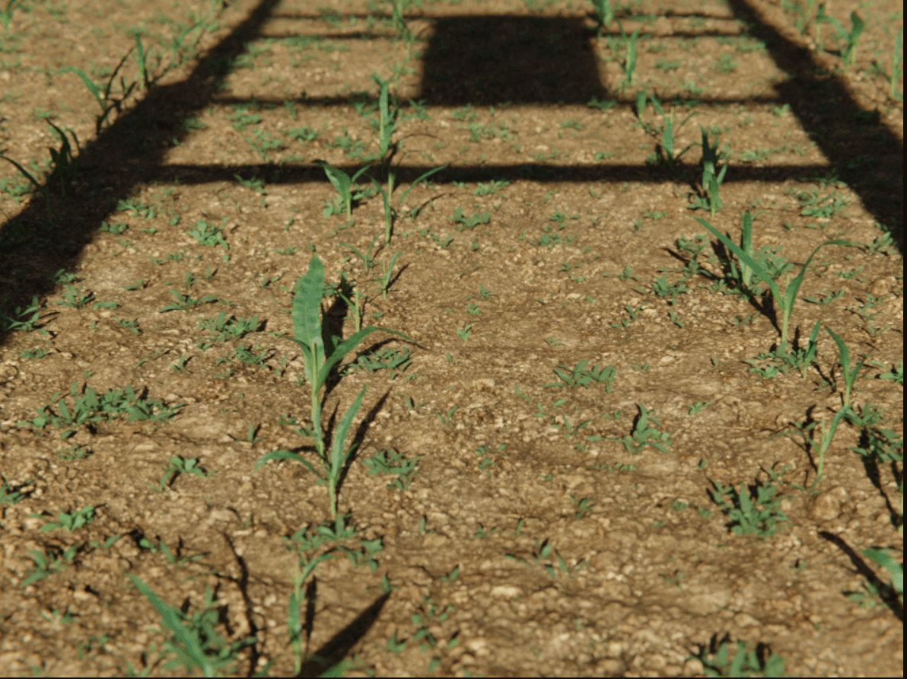

# Introduction

<figure markdown="span">
  { width="224" }
</figure>

Syclops is a tool for creating synthetic data from 3D virtual environments.

---
# 🎯 Features
📷 Photorealistic renderings of the virtual environment with pixel-perfect annotations

📄 No-Code scene and sensor configuration with a simple YAML syntax

🔧 Extensive randomization tools to increase the diversity of the generated data

💾 Asset management and viewer to easily reuse assets across multiple scenes

📦 Easy to use and extend with a modular architecture

# 🔍 Annotations
<figure markdown="span">
  { width="400" }
</figure>

Syclops supports a variety of annotated outputs for different use cases. The following outputs are currently supported:

|Output|Description|
|:---:|:---:|
|**RGB**|Rendered color image|
|**Semantic Segmentation**|Semantic segmentation mask with class ids|
|**Instance Segmentation**|Unique instance id for each object in the scene|
|**Depth**|Distance from the camera to each pixel|
|**Bounding Boxes**|Bounding boxes for each object in the scene|
|**Object Positions**|3D position of each object in the scene|
|**Point Cloud**|3D location of each pixel in camera space|
|**Keypoints**|Location of keypoints in camera space|
|**Object Volume**|Volume of each object in the scene|
|**Structured Light**| Projected dot pattern for structured light reconstruction|

# 📣 Terminology
|Term|Description|
|:---:|:---:|
|**Scene**|A scene is a virtual 3D environment that is used by the pipeline to generate sensor data.|
|**Job**|A job is a YAML file that defines the environment, sensors, and output of a scene.|
|**Plugin**|A plugin is a python class that is used to extend the functionality of the pipeline. It can create new elements in the scene, simulate a sensor, or add a new output.|
|**Asset**|An asset is something that can be used by the pipeline. This can be a 3D model, a texture, or a material.|

