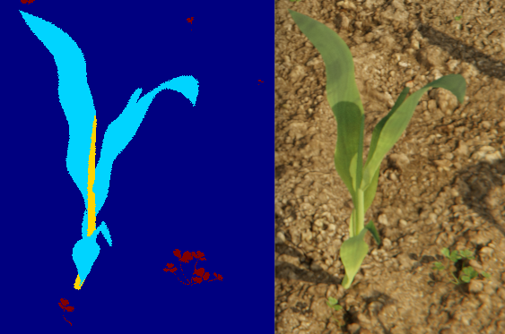

# Pixel Annotation Output Documentation

The Pixel Annotation Output is dedicated to providing various pixel-level annotations of the sensor image. This encompasses a range of annotations from semantic segmentation to the volume of objects.

## Inter Class Segmentation

In Syclops it is possible to have multiple class labels for a single object. This means, that a plant can have the segmentation labels `stem` and `leaf` at the same time.


It has to be configured in the scene description for the object that should have multiple labels. The following example shows how to configure it:

```yaml title="Configure Inter Class Segmentation"
  syclops_plugin_scatter:
    - name: "Corn Scatter"
      ...
      class_id: 2 # (1)!
      class_id_offset:
        Stem: 1 # (2)!
      ...
```

1.  Base class label for the object.
2.  Offset for the material `Stem`.

This will result in the scattered corn objects to have the class label 2 for the whole object and the class label 3 for the part of the object that has the material `Stem` assigned.

## Configuration Parameters

The following table describes each configuration parameter for the Pixel Annotation Output:

| Parameter               | Type                                            | Description                                                                                                         | Requirement               |
|-------------------------|-------------------------------------------------|---------------------------------------------------------------------------------------------------------------------|---------------------------|
| **`semantic_segmentation`** | object                                          | Represents the semantic segmentation output where pixels are mapped with the class id value of the object.           | **Optional**              |
|     ↳ `id`              | string                                          | Unique identifier of the output.                                                                                    | **Required** for this annotation type |
| **`instance_segmentation`** | object                                          | Produces an instance segmentation output, tagging each object with a unique id in the image.                        | **Optional**              |
|     ↳ `id`              | string                                          | Unique identifier of the output.                                                                                    | **Required** for this annotation type |
| **`pointcloud`**            | object                                          | Offers 3D coordinates of every pixel in the camera coordinates in meters.                                           | **Optional**              |
|     ↳ `id`              | string                                          | Unique identifier of the output.                                                                                    | **Required** for this annotation type |
| **`depth`**                 | object                                          | Displays the Z Depth of a pixel relative to the camera in meters.                                                   | **Optional**              |
|     ↳ `id`              | string                                          | Unique identifier of the output.                                                                                    | **Required** for this annotation type |
| **`object_volume`**         | object                                          | Shows the volume of objects in cm^3.                                                                                | **Optional**              |
|     ↳ `id`              | string                                          | Unique identifier of the output.                                                                                    | **Required** for this annotation type |
| `debug_breakpoint`      | boolean                                         | Decides if the rendering process should pause and open Blender before proceeding. Only functions with scene debugging active. | **Optional**              |

!!! note
    Ensure that each annotation type, if used, contains a unique `id`. The `id` is imperative for differentiating between various annotations.

## Example Configuration

```yaml
syclops_output_pixel_annotation:
  - semantic_segmentation:
      id: "seg1"
      class_id_offset: true
  - instance_segmentation:
      id: "inst1"
  - pointcloud:
      id: "pc1"
  - depth:
      id: "depth1"
  - debug_breakpoint: true
```

In the provided configuration, a variety of pixel annotations are set up, each with their unique identifiers. Additionally, if the [scene debugging](../../../developement/debugging.md#visually-debug-a-job-file) is active, the scene will break and open in Blender before rendering.

## Metadata Output

Along with the output files, a `metadata.yaml` file is generated in the output folder. This file contains metadata about the keypoint output, including the output type, format, description, expected steps, sensor name, and output ID.
