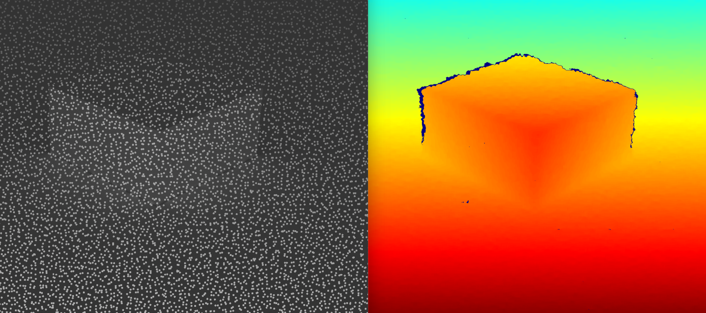

# Structured Light Output Documentation

The Structured Light Output generates structured light patterns projected onto the scene, which can be used for 3D reconstruction and depth estimation.



## Configuration Parameters

The following table describes each configuration parameter for the Structured Light Output:

| Parameter | Type | Description | Requirement |
|-----------|------|-------------|-------------|
| `id` | string | A unique identifier for the output. | **Required** |
| `frame_id` | string | The ID of the transformation frame to which the structured light projector is attached. | **Required** |
| `intensity` | float | The intensity of the projected light pattern. | **Required** |
| `scale` | float | The scale of the light pattern, controlling the density of the dots. | **Required** |
| `samples` | integer | The number of samples per pixel for rendering the structured light image. Higher values result in better quality but slower rendering. | **Required** |
| `debug_breakpoint` | boolean | If set to `true` and the [scene debugging](../../../developement/debugging.md#visually-debug-a-job-file) is active, the rendering process will pause and open Blender before proceeding. | Optional |

## Example Configuration

```yaml
syclops_output_structured_light:
  - id: main_cam_structured_light
    frame_id: "camera_link"
    intensity: 10000
    scale: 60
    samples: 256
    debug_breakpoint: True
```

In this example, a structured light output is configured with the identifier `main_cam_structured_light`. The light projector is attached to the `camera_link` transformation frame. The intensity of the projected pattern is set to 10000, and the scale is set to 60. The image will be rendered with 256 samples per pixel. If scene debugging is active, the rendering process will pause and open Blender before proceeding.

## Output Format

The structured light output is saved as a grayscale PNG image for each frame, with the projected dot pattern visible on the scene objects. The images are stored in the `<sensor_name>_annotations/structured_light/` folder.


The structured light output can be used in multiple cameras to simulate stereo vision and generate depth maps. The structured light patterns can be used for 3D reconstruction and depth estimation.