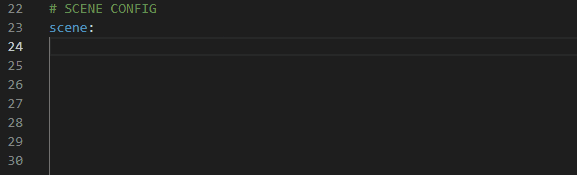

# Validation

Syclops generates a YAML schema that defines the job configuration rules. This schema can be used for auto-completion and linting, but also to get more information about a specific property.

During asset crawling, Syclops looks for all schema files of the plugins and creates a single ```schema.yaml``` in the install folder.
In order to use the linting features for the job descriptions, the IDE has to be pointed towards the schema file.

<figure markdown="span">
  { width="500" }
  <figcaption>Linting of job description</figcaption>
</figure>

=== "VSCode"
  For Visual Studio Code, the [YAML extension](https://marketplace.visualstudio.com/items?itemName=redhat.vscode-yaml) needs to be installed.
  In the VSCode settings.json, the following entry has to be set. This will apply the schema to all YAML files ending with **_syclops.yaml_**.
  ```json
    "yaml.schemas": {
      "<path/to/schema.yaml>": "*syclops.yaml"
    },
  ```