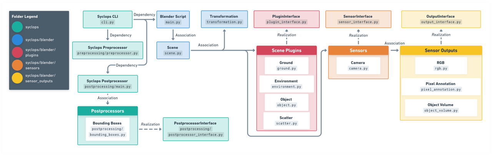

# Summary

Syclops is an open-source, modular pipeline designed for generating large-scale, photorealistic synthetic datasets with precise ground truth annotations. Built on top of the Blender [@blender] 3D creation suite, Syclops offers a flexible and extensible framework for researchers and developers in computer vision, robotics, and related fields. Key features include:

1. A plugin-based architecture for easy extensibility
2. Procedural generation of diverse, large-scale environments
3. Photorealistic rendering using Blender's Cycles engine
4. Multi-modal sensor simulation (e.g., RGB cameras, depth sensors, stereo depth cameras, structured light)
5. Accurate ground truth annotation generation
6. Dynamic scene configuration via YAML-based job files
7. Scalability to handle environments with millions of objects

Syclops addresses the growing need for high-quality, diverse synthetic data in AI model development and testing, particularly in scenarios where real-world data collection is challenging, expensive, or time-consuming.

# Statement of Need

The performance of machine learning models, especially in computer vision and robotics, heavily depends on the quality and diversity of training data. However, obtaining real-world data can be expensive, time-consuming, and challenging, particularly for rare events or scenarios that are difficult to capture [@tabkhi2022real]. Synthetic data generation offers a promising solution to these challenges, allowing for the creation of large, diverse datasets with accurate ground truth annotations [@mumuni2024survey].

Syclops fills an important gap in the landscape of synthetic dataset tools. While several tools exist for generating synthetic data, Syclops distinguishes itself through its focus on large-scale procedural generation, particularly for outdoor and agricultural scenarios. Table 1 compares Syclops with other prominent synthetic data generation tools.

<!-- Die Formatierung der Tabelle ist ungewöhnlich, Tabellen benötigen eigentlich eine Caption (was ein Stück weit durch die ursprüngliche 'Legende' umgesetzt war), welche *über* der Tabelle steht sowie eine Nummer. -->

**Table 1**: Comparison of tools for synthetic data creation. Features are abbreviated as follows: SS=Semantic Segmentation, IS=Instance Segmentation, D=Depth, OF=Optical Flow, SN=Surface Normals, OC=Object Coordinates, BB=Bounding Box, OP=Object Pose, V=Object Volume, KP=Keypoints, PS=Python Script, C=Camera, SC=Stereo Camera with Projected Light, L=Lidar

| Tool         | Rendering Engine | Scene Creation | Output Annotations                   | Sensors |
| ------------ | ---------------- | -------------- | ------------------------------------ | ------- |
| Syclops      | Blender Cycles   | YAML           | SS, IS, D, OF, SN, OC, BB, OP, KP, V | C, SC   |
| Kubric       | Blender Cycles   | PS             | SS, IS, D, OF, SN, OC, BB, OP        | C       |
| Blenderproc2 | Blender Cycles   | PS             | SS, IS, D, OF, SN, OC, BB, OP        | C, SC   |
| NViSII       | Nvidia Optix     | PS             | SS, D, OF, SN, OC, BB, OP            | C       |
| NDDS         | Unreal Engine 4  | UE4 GUI        | SS, D, BB, OP, KP                    | C       |
| iGibson      | PBR Rastering    | PS             | SS, IS, D, OF, BB                    | C, L    |

While tools like Kubric [@greff2022kubric] and Blenderproc2 [@denninger2023blenderproc2] offer similar rendering capabilities and annotations, Syclops stands out with its YAML-based, procedural scene creation, which enhances ease of use. Additionally, Syclops includes unique features such as volume estimation and specialized support for agricultural scenarios.

# Key Features

Syclops offers several key features that set it apart from existing synthetic data generation tools:

1. Large-scale Procedural Generation: Syclops excels at creating vast, complex environments with millions of scattered objects, making it particularly suitable for outdoor scenarios such as agricultural environments.

2. YAML-based Scene Configuration: Users can easily define and customize complex scenes using a simple YAML syntax, enhancing reproducibility and ease of use.

3. Modular Architecture: Built on a plugin-based architecture, Syclops allows users to easily extend its functionality with custom scene elements, sensors, and outputs.

4. Multi-modal Sensor Simulation: Syclops can simulate various sensor types, including RGB cameras and stereo cameras with projected light, providing versatile datasets for different applications.

5. Comprehensive Ground Truth Annotations: The pipeline generates a wide range of accurate ground truth annotations, including semantic segmentation, instance segmentation, depth maps, object coordinates, bounding boxes, object poses, keypoints, and object volume.

6. Agricultural Focus: While versatile, Syclops has a particular emphasis on agricultural and outdoor scenarios, addressing a gap in existing synthetic data generation tools.

# Architecture and Implementation

Syclops is implemented in Python and uses Blender's Python API for 3D scene creation and rendering. The pipeline consists of several key components (compare Fig. 1 for an overview):

1. Job Configuration: A YAML-based system for defining scene composition, sensor properties, and output types.
2. Asset Management: A module for organizing and accessing 3D models, textures, and materials.
3. Scene Generation: Plugins for creating and manipulating scene elements, with a focus on efficient placement of large numbers of objects.
4. Sensor Simulation: Modules for simulating different sensor types and their properties.
5. Output Generation: Plugins for producing different types of sensor outputs and ground truth annotations.
6. Postprocessing: Tools for refining and processing the generated data.
   Syclops leverages Blender's Geometry nodes for procedural placement of objects combined with object instancing. This approach allows for performant scenes with large amounts of objects while maintaining variability. Additionally, Syclops incorporates convex decomposition of objects for efficient rigid body simulation, further enhancing its capabilities for complex scene generation.
   The modular architecture allows users to easily extend Syclops with custom plugins for specific use cases or novel sensor types.
<!-- Der letzte Satz (Zeie 94) gehört irgendwie nicht in das Listenelement...? -->



# Example Usage

The following YAML code describes a synthetic dataset of RGB and depth images of trees scattered across a flat plane:

```yaml
# job_config.yaml
general:
  steps: 100
  seeds:
    numpy: 42
    cycles: 42

scene:
  syclops_plugin_ground:
    - name: "Ground"
      size: 50
      texture: "Example Assets/Muddy Dry Ground"
      class_id: 1

  syclops_plugin_scatter:
    - name: "Trees"
      models: "Example Assets/Trees"
      floor_object: "Ground"
      density_max: 0.1
      class_id: 2

sensor:
  syclops_sensor_camera:
    - name: "main_camera"
      frame_id: "camera_link"
      resolution: [1280, 720]
      focal_length: 35
      outputs:
        syclops_output_rgb:
          - id: "main_rgb"
            samples: 256
        syclops_output_pixel_annotation:
          - semantic_segmentation:
              id: "main_semantic"
          - depth:
              id: "main_depth"
```

Note that the elements of the scene description (e.g. "syclops_plugin_scatter") or sensor definition (e.g. "syclops_sensor_camera") are identifiers for the individual plugins that can process the respective YAML data blocks.

In order to generate this dataset with Syclops, the following simple command is executed:

```bash
syclops -j job_config.yaml
```

The assets used for data generation in this example are included in the Syclops repository for demonstration purposes.

# Use Cases

Syclops has been successfully applied in several real-world scenarios, including the Semantic segmentation of crop and weed plants in agricultural fields, providing large-scale, diverse datasets for training robust machine learning models as well as volume estimation of vegetables on a conveyor belt with physics simulation, demonstrating Syclops' capability to generate synthetic data for industrial automation applications. These use cases highlight Syclops' versatility in generating synthetic data for both outdoor and indoor scenarios, as well as its ability to simulate complex interactions between objects.

We evaluated Syclops' performance and quality on the public Phenobench Benchmark [@weyler2024phenobench], a dataset of sugarbeets and weeds in agricultural fields (see Fig. 2 for an example).
For the semantic segmentation task, the model trained on 3,000 Syclops-generated images achieved a mean Intersection over Union (mIoU) of 80.7, compared to 85.97 for the model trained on real-world images. This demonstrates that Syclops can produce high-quality synthetic data that closely approximates real-world scenarios, while also enabling the generation of larger datasets.


# Limitations and Future Work

While Syclops offers powerful capabilities for synthetic data generation, it currently does not procedurally generate individual assets. High-quality assets are crucial for producing good synthetic data, and this remains an area for potential improvement. Future work will focus on developing tools for procedural generation of individual objects, further expanding Syclops' capabilities.

Additionally, planned developments include expanding the range of supported sensor types, improving the realism of generated data and enhancing the efficiency of large-scale scene generation.

# Conclusion

Syclops provides a powerful, flexible tool for generating high-quality synthetic datasets for computer vision and robotics applications. Its modular architecture, extensive customization options, and focus on large-scale procedural generation make it particularly suitable for outdoor and agricultural scenarios. By enabling the creation of diverse, annotated datasets, Syclops aims to accelerate research and development in computer vision, robotics, and machine learning applications.

# Acknowledgements

Many thanks to Henning Wübben, Florian Rahe, Thilo Steckel and Stefan Stiene for their valuable feedback during the development of Syclops.
Syclops was developed in the research project Agri-Gaia. This work was supported by the German Federal Ministry for Economic Affairs and Climate Action within the Agri-Gaia project (grant number: 01MK21004A). The DFKI Niedersachsen (DFKI NI) is sponsored by the Ministry of Science and Culture of Lower Saxony and the VolkswagenStiftung.

# COI Disclosure

Two of the authors (Anton Elmiger and Kai von Szadkowski) have founded a start-up company for AI services based on synthetic data in 2024 after the major work on Syclops (and this paper) was completed. Syclops is being utilized in this context as a tool to create artefacts, but not directly marketed and sold in any fashion (it is published as OSS under GPL 3.0, after all), so that no direct financial interest would lead to its unduly promotion. Work in this company currently happens as a part-time occupation in parallel to continued research activities for the DFKI in related topics. As Syclops is OSS under the GPL 3.0 license, the software is not
